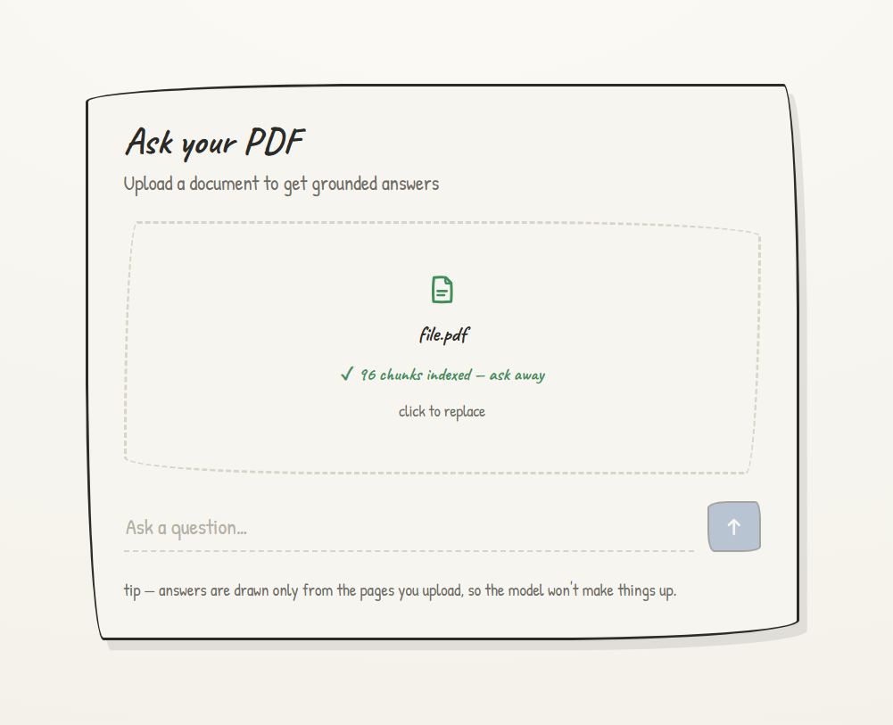
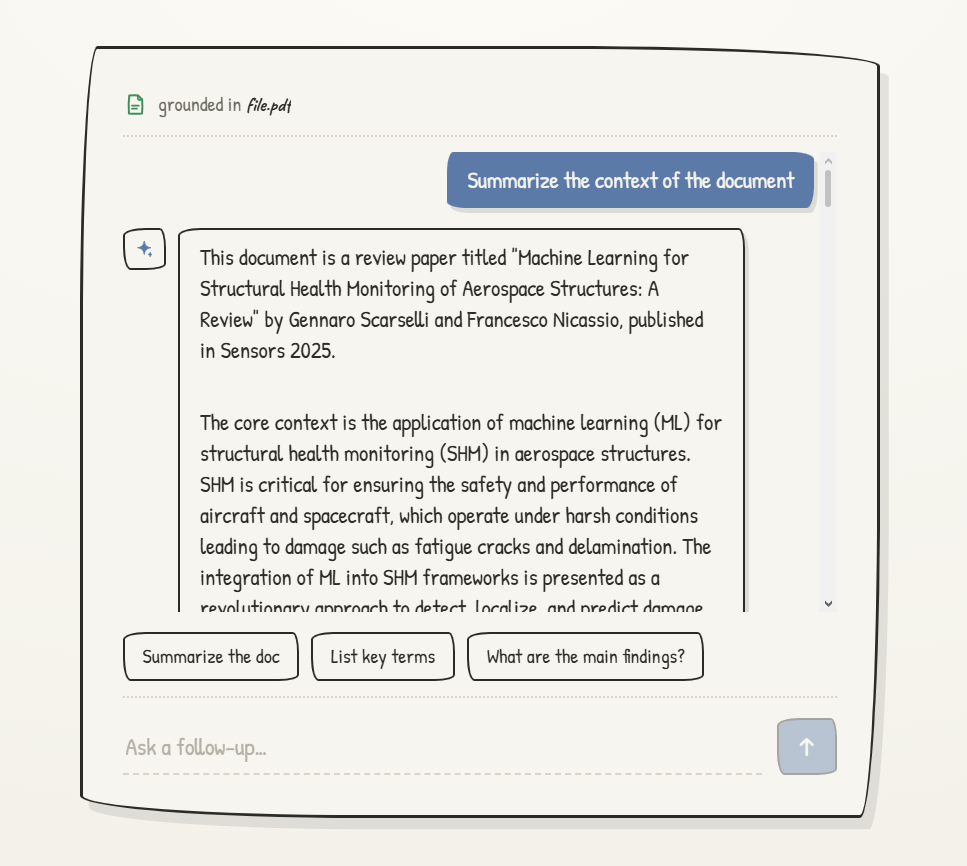
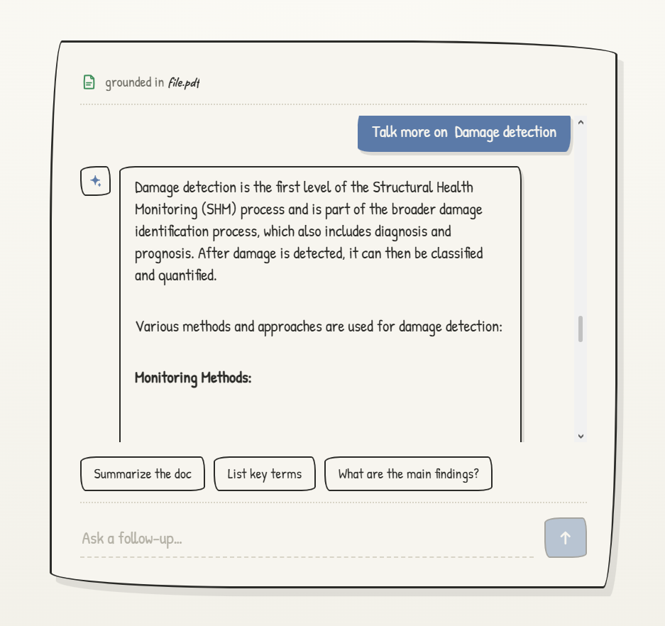
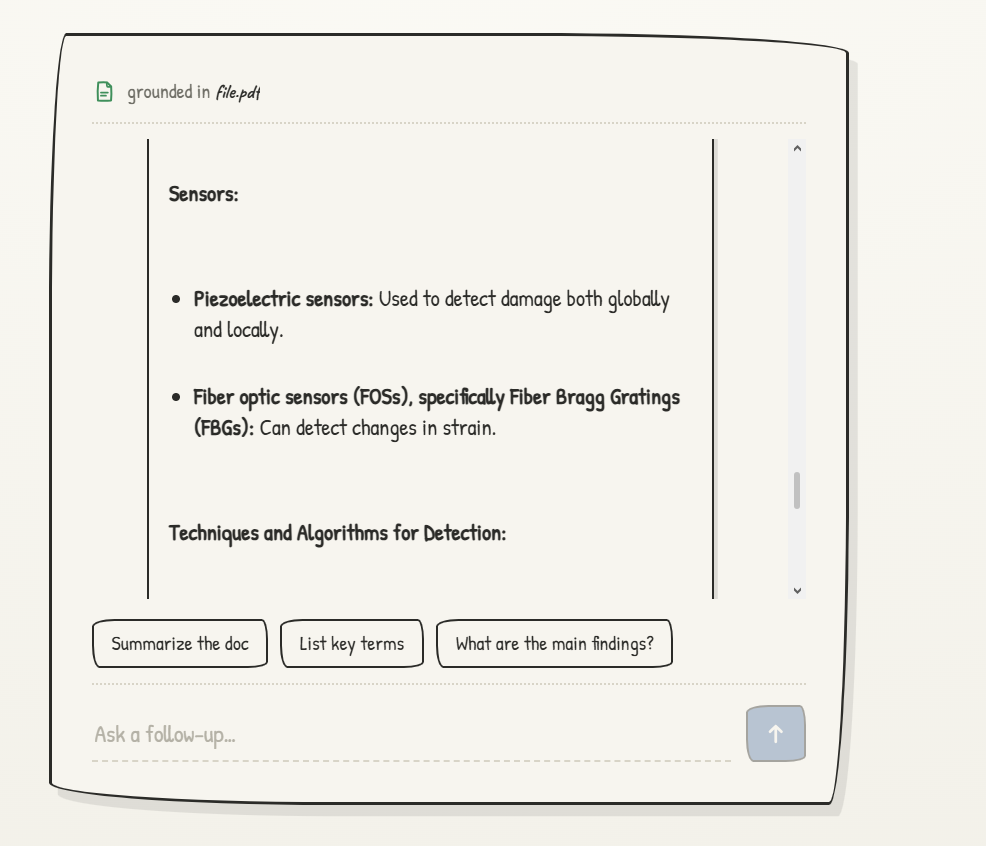

# RAG System v1

A retrieval-augmented generation (RAG) system built from scratch — **PDF in, grounded answers out** — deliberately implemented *without* high-level frameworks like LangChain, so every layer (chunking, embeddings, vector storage, similarity search, generation) is written and understood directly rather than abstracted away.

What started as a command-line pipeline now has a full-stack interface: a **Next.js** frontend and a **FastAPI** backend wrapping the same hand-built pipeline, with a hand-drawn, notebook-style UI for uploading a PDF and chatting with it.

> **Learning project, v1.** The goal wasn't to ship a product — it was to understand the internals of RAG by building each brick by hand: first as scripts, then refactored into a reusable pipeline behind a real API and UI. The system works end to end, and its limitations (including why it currently runs locally) are documented honestly below.

---

## Demo

   

---

## What it does

Upload a PDF and ask a question in plain English. The system:

1. Extracts the document text and splits it into overlapping chunks
2. Converts each chunk into a vector embedding (locally, no API cost)
3. Stores those vectors in a Postgres + `pgvector` database
4. Embeds your question and finds the most semantically similar chunks
5. Feeds those chunks to an LLM, which writes an answer **grounded in the document** — and returns the source chunks the answer was based on

The same pipeline is reachable two ways: as standalone scripts (`test.py` for indexing, `generation.py` for querying) and through the web app (`web/` + `server/`).

## Architecture

```
                 Browser
                    │  PDF / question
                    ▼
        Next.js app (web/, :3000)
   ┌────────────────────────────────────┐
   │  /api/upload   /api/query           │   server-side route handlers
   │  (proxy → never expose Python to    │   so the browser never talks
   │   the browser directly)             │   to FastAPI directly
   └────────────────┬───────────────────┘
                    │  HTTP
                    ▼
        FastAPI service (server/app.py, :8000)
        /health  /upload  /query
                    │
                    ▼
        pipeline.py  (clients loaded once, reused)
   ┌────────────────────────────────────────────┐
   │  PyPDF2 → FixedTokenChunker → MiniLM (local) │
   │  → Supabase/pgvector → Gemini                │
   └────────────────────────────────────────────┘
```

## Pipeline

```
PDF
 └─ text extraction              (PyPDF2)
     └─ chunking                 (token-based, 512 tokens / 100 overlap)
         └─ embeddings           (MiniLM, local, 384-dim)
             └─ vector storage   (Supabase / pgvector)
                 └─ retrieval     (cosine similarity, top-k via SQL RPC)
                     └─ augmentation  (retrieved chunks injected into prompt)
                         └─ generation  (Gemini, constrained to provided context)
                             └─ grounded answer (+ source chunks)
```

## How it works

**Indexing** — `pipeline.index_pdf()` (and the original `test.py`)
- PDF text is extracted with **PyPDF2**.
- Text is chunked with a fixed-token chunker (`FixedTokenChunker` from `chunking_evaluation`) at **512 tokens with 100-token overlap**, using `cl100k_base` purely as a size ruler.
- Each chunk is embedded **locally** with `sentence-transformers` (`paraphrase-multilingual-MiniLM-L12-v2`, **384 dimensions**) — chosen so ingestion never hits API rate limits or cost.
- Chunks + vectors are upserted into a Supabase `document_chunks` table. The web flow is **single-document scoped**: each new upload clears the table first, so retrieval can't bleed across previously uploaded PDFs.

**Retrieval + Generation** — `pipeline.answer_question()` (and the original `generation.py`)
- The question is embedded with the **same MiniLM model** (mandatory — query and chunk vectors must live in the same space to be comparable).
- A Postgres `match_documents` function performs cosine-similarity search and returns the top-k chunks. PostgREST doesn't expose pgvector operators directly, so the search is wrapped in a SQL function and called via `rpc()`.
- A low threshold + generous count favours recall and lets the LLM filter the noise.
- The retrieved chunk text is injected into a grounding prompt instructing the model to answer **only** from the provided context.
- **Google Gemini** (`gemini-2.5-flash`) generates the final answer, and the API returns the source chunks (text preview + similarity) so the UI can show what the answer was based on.

## Repository structure

```
rag_system_v1/
├── generation.py            # standalone query script (CLI path)
├── test.py                  # standalone indexing script (CLI path)
├── server/                  # FastAPI backend
│   ├── app.py               #   endpoints: /health, /upload, /query
│   ├── pipeline.py          #   reusable pipeline (cached model + clients)
│   └── requirements.txt     #   backend dependencies (the maintained list)
├── web/                     # Next.js frontend (App Router, TS, Tailwind)
│   └── app/
│       ├── api/upload/route.ts   # server-side proxy → FastAPI /upload
│       ├── api/query/route.ts    # server-side proxy → FastAPI /query
│       ├── components/           # RagApp, UploadPanel, ChatPanel, icons
│       ├── lib/                  # api.ts (RAG_API_URL), types.ts
│       └── page.tsx, layout.tsx, globals.css
├── reference/               # design reference (mockup + screenshot)
└── LICENSE.txt
```

## Tech stack

| Layer | Tool |
|---|---|
| Frontend | Next.js 16 (App Router), React 19, TypeScript, Tailwind CSS v4 |
| Backend | FastAPI + Uvicorn |
| PDF extraction | PyPDF2 |
| Chunking | `chunking_evaluation` (`FixedTokenChunker`) |
| Embeddings | `sentence-transformers` — `paraphrase-multilingual-MiniLM-L12-v2` (local, 384-dim) |
| Vector store | Supabase (Postgres + `pgvector`) |
| Generation | Google Gemini (`gemini-2.5-flash`) |

## Running it locally

You'll run three things: the database (Supabase), the backend (FastAPI on `:8000`), and the frontend (Next.js on `:3000`).

### 1. Database

Run once in the Supabase SQL editor:

```sql
-- Enable the extension
create extension if not exists vector;

-- Table
create table document_chunks (
    id            bigserial primary key,
    document_name text   not null,
    chunk_index   int    not null,
    chunk_text    text   not null,
    embedding     vector(384),
    unique (document_name, chunk_index)
);

create index idx_chunks_document_name on document_chunks(document_name);
create index idx_chunks_embedding on document_chunks using hnsw (embedding vector_cosine_ops);

-- Similarity search function
create or replace function match_documents (
    query_embedding vector(384),
    match_threshold float,
    match_count     int
)
returns table (
    id            bigint,
    document_name text,
    chunk_index   int,
    chunk_text    text,
    similarity    float
)
language sql stable
as $$
    select
        document_chunks.id,
        document_chunks.document_name,
        document_chunks.chunk_index,
        document_chunks.chunk_text,
        1 - (document_chunks.embedding <=> query_embedding) as similarity
    from document_chunks
    where 1 - (document_chunks.embedding <=> query_embedding) > match_threshold
    order by document_chunks.embedding <=> query_embedding asc
    limit match_count;
$$;
```

### 2. Environment variables

Create a `.env` file **in the repo root** (the backend loads it from one level above `server/`). Never commit it.

```
GEMINI_API_KEY=your_key_here
SUPABASE_URL=https://your-project.supabase.co
SUPABASE_SERVICE_ROLE_KEY=your_service_role_key
```

> The **service role key** bypasses Row Level Security and is appropriate for this server-side backend. Keep it out of version control and never expose it client-side.

### 3. Backend (FastAPI)

```bash
cd server
python -m venv .venv && source .venv/bin/activate   # Windows: .venv\Scripts\activate
pip install -r requirements.txt
uvicorn app:app --reload --port 8000
```

The first run downloads the MiniLM model (a few hundred MB). Sanity-check it with `curl http://127.0.0.1:8000/health`.

### 4. Frontend (Next.js)

```bash
cd web
npm install
npm run dev
```

Open **http://localhost:3000**. The frontend talks to the backend via `RAG_API_URL` (defaults to `http://127.0.0.1:8000`); override it with an env var if your backend runs elsewhere.

### CLI path (no UI)

The original scripts still work for a quick, interface-free run: put a PDF named `file.pdf` next to `test.py`, run `test.py` to index it, then edit the `question` in `generation.py` and run it.

## API

| Method | Endpoint | Body | Returns |
|---|---|---|---|
| `GET` | `/health` | — | `{ "status": "ok" }` |
| `POST` | `/upload` | multipart PDF (≤ 15 MB) | `{ document_name, chunks }` |
| `POST` | `/query` | `{ "question": "..." }` | `{ answer, sources[] }` |

`sources` carries each retrieved chunk's `document_name`, `chunk_index`, `similarity`, and a text `preview`, so the answer is always traceable back to the document.

## Design notes

- **No LangChain, on purpose.** Every stage is implemented directly to learn how RAG actually works under the hood.
- **Local embeddings, API generation.** Embeddings are high-volume (every chunk, every re-index); generation is low-volume (a few calls per question). Running embeddings locally with MiniLM avoids rate limits entirely, while Gemini handles the cheaper generation step.
- **Same model for documents and queries.** The embedding model and its 384-dim output are locked in — changing models means re-embedding everything.
- **Server-side proxying.** The browser never calls the Python service directly; Next.js route handlers forward requests, keeping the backend and its keys off the client.
- **Clients loaded once.** The MiniLM model and the Supabase/Gemini clients are cached for the process lifetime so each request doesn't reload them.

## Deployment status

**Currently runs locally only — by deliberate decision, not an oversight.** The embedding step needs `sentence-transformers` + PyTorch + the MiniLM weights loaded in memory, which doesn't fit the constraints of the obvious free tiers:

- **Render free tier (512 MB)** OOMs while loading the model.
- **Vercel Python functions** are ruled out by the bundle-size limit and short execution timeout — PyTorch is far too heavy.

Hosting it properly means a paid container with enough memory (or moving embeddings to a hosted inference API, which trades cost/rate-limits back in). For a v1 learning project that wasn't worth it, so the system is demoed via the video/screenshots above rather than a live URL.

## Known limitations (v1)

An honest accounting, not a finished product:

- **Naive PDF extraction.** PyPDF2 pulls in references, headers, and page numbers, which get chunked and embedded alongside real content and can surface as low-value matches. No cleaning step yet.
- **Single-document workflow.** The schema supports multiple documents (`document_name`), but the web flow indexes one PDF at a time and clears the table on each upload.
- **`match_threshold` needs per-document tuning** — generic queries return low similarity scores.
- **No persistence of chat history** across reloads.
- The HNSW index is present but unnecessary at this scale (added for correctness/practice).

## Roadmap

- [ ] PDF cleaning step (strip references, headers, page artifacts before chunking)
- [ ] Multi-document support with `document_name` filtering in retrieval
- [ ] Show retrieved sources inline in the chat UI
- [ ] Proper hosting (memory-backed container or hosted embedding inference)
- [ ] Deep-link integration with the Task Tracker

## References & learning resources

Built incrementally while learning from:

- [What are embeddings? — Cloudflare](https://www.cloudflare.com/en-gb/learning/ai/what-are-embeddings/)
- **Adam Lucek** — [Vector Databases guide](https://github.com/ALucek/embeddings-guide/blob/main/WTF_VDB.ipynb) and [Chunking Strategies](https://github.com/ALucek/chunking-strategies/blob/main/chunking.ipynb), plus accompanying videos: [[1]](https://www.youtube.com/watch?v=NMfArmQ27m4) [[2]](https://youtu.be/Pk2BeaGbcTE)
- [`all-MiniLM-L12-v2` model card — Hugging Face](https://huggingface.co/sentence-transformers/all-MiniLM-L12-v2)
- [pgvector](https://github.com/pgvector/pgvector)
- [Vector columns — Supabase Docs](https://supabase.com/docs/guides/ai/vector-columns)

## License

MIT — see `LICENSE.txt`
